# Meli - Android App :star:

This is an Android app that shows a list of products from Mercado Libre and the detail of each one.
The app is built entirely with Kotlin and Jetpack compose and modularized.

- [x] Fetches data from the Mercado Libre API
- [x] Shows a list of products
- [x] Shows the detail of each product
- [x] Shows the description of each product
- [x] Pagination for search results
- [x] Error handling
- [x] Material Dynamic Theme support (Disabled by default) and dark and light mode.
- [x] Unit tests

## Requirements

- Android Studio 4.1.1
- Android SDK 22 or higher
- Kotlin 1.8.20
- Gradle 8.2.0
- Android API 22+

Clone this repo and import into Android Studio.

```bash
git clone git@github.com:jocode/Meli-MobileTest.git
```

## Screenshots

- **Light Mode**

|                           Splash                           |                     Search                     |                    Item                    |
|:----------------------------------------------------------:|:----------------------------------------------:|:------------------------------------------:|
|       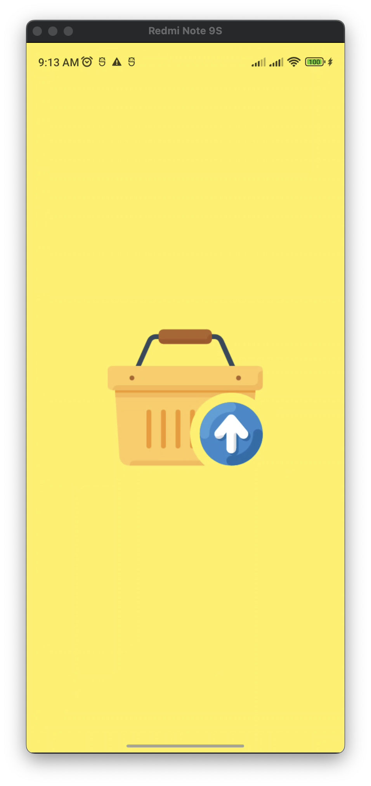       | 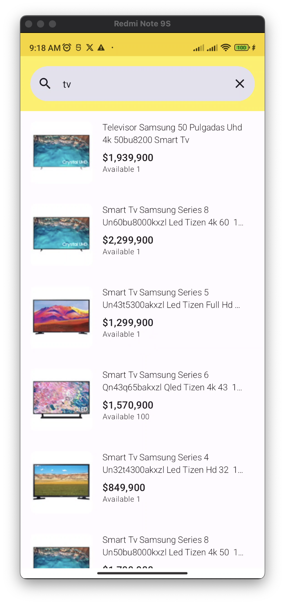 | 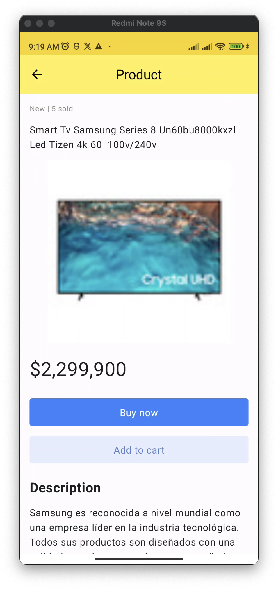 |
|                        Empty Search                        |                     Error                      |                                            |
| 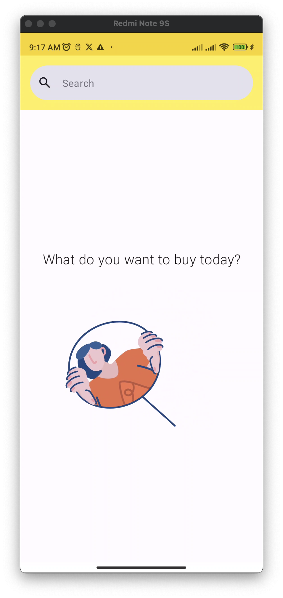 |  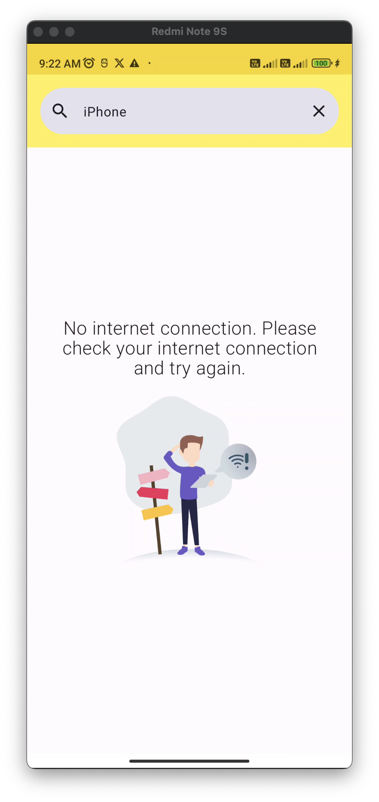  |                                            |

- **Dark Mode**

|                          Splash                           |                    Search                     |                   Item                    |
|:---------------------------------------------------------:|:---------------------------------------------:|:-----------------------------------------:|
|       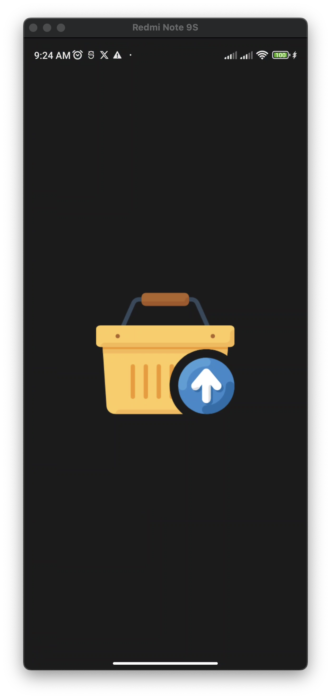       | 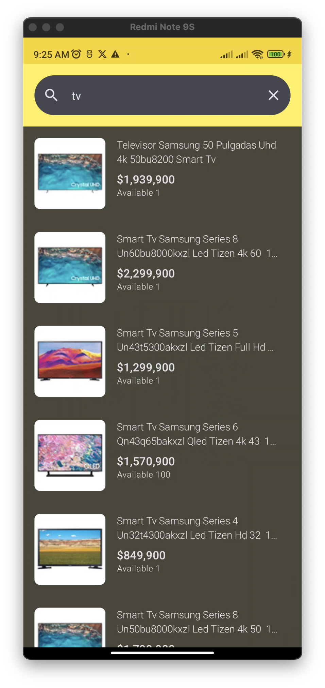 | 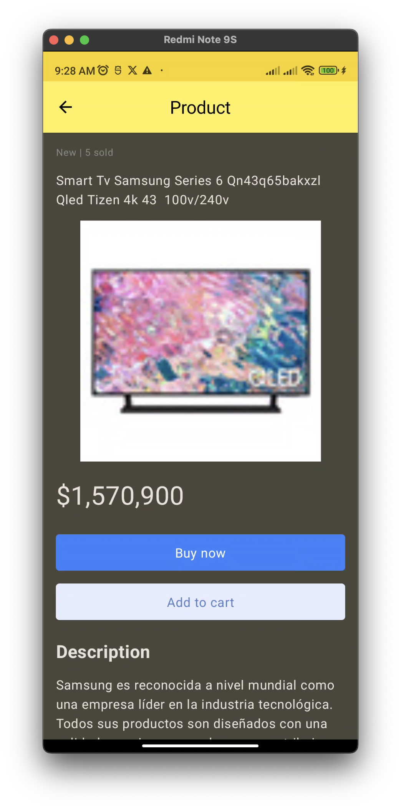 |
|                       Empty Search                        |                     Error                     |                                           |
| 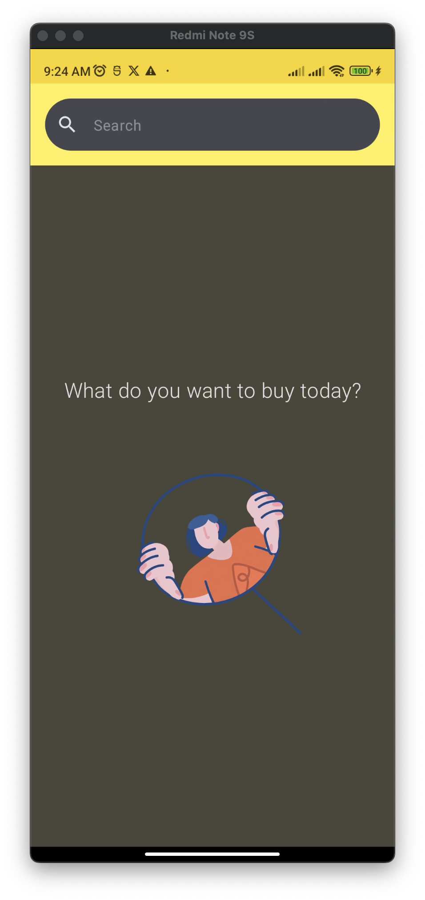 |  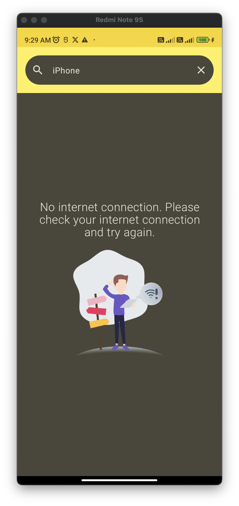  |                                           |

## Stack & Libraries

- Kotlin
- Jetpack Compose
- Coroutines
- Flow
- Hilt
- Retrofit
- Moshi
- OkHttp
- Coil
- SplashScreenApi
- Compose Paging
- Compose Navigation
- Timber
- Lottie
- [Version catalog](https://docs.gradle.org/current/userguide/platforms.html)
- Modularization based on Clean Architecture Pattern

## :dart: Architecture

This app is built using the Clean Architecture pattern, following the principles of SOLID and the
separation of concerns.
Also the app have been modularized in order to have a better organization and to be able to reuse
the modules in other projects. The modularization is based on feature and layered modules.

Modularization is a practice that consists of dividing an application into several modules, each one
with its own responsibility. This allows us to have a better organization of the code, to be able to
reuse the modules in other projects and to be able to work in parallel in different modules.

The app is based in the [Modularization Guides](https://developer.android.com/topic/modularization)
from Android Developers.

This is the dependency graph of the app:

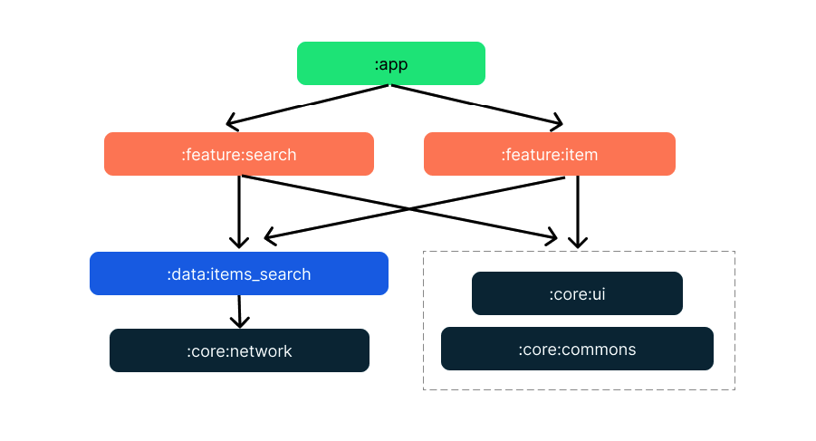

Following the Clean Architecture pattern layers.


The organization of the application is based on the following diagram:

    :app/
    :core/
    ├── :common/
    ├── :domain/
    ├── :model/
    ├── :network/
    ├── :ui/
    :data/
    ├── :items_search
    :feature/
    ├── :search
    └── :detail

- **app:** Contains the application class and the main activity.
- **core:** Contains the common code of the application.
    - **common:** Contains the common code of the application.
    - **domain:** Contains the use cases of the application.
    - **model:** Contains the models of the application, the business models
    - **network:** Contains the network layer of the application, the retrofit setup and utils
      classes for response handling.
    - **ui:** Contains the UI base components of the app.
- **data:** Contains the data layer of the application, per functionality.
    - **:items_search:** Contains the search item data source and repository.
- **feature:** Contains the features of the application, each feature represents a screen or a group
  of screens.
    - **:search:** Contains the search feature, the UI and the view model.
    - **:detail:** Contains the item detail feature, the UI and the view model.

## :hammer: Testing

For unit testing the application we use:

- JUnit
- Mockk
- MockWebServer
- Core Testing
- Coroutines Test